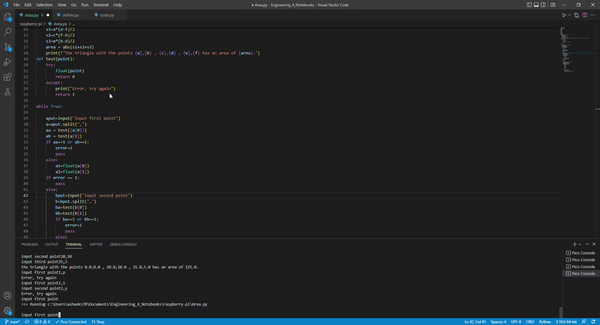
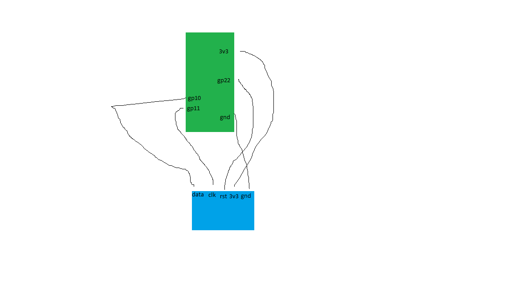
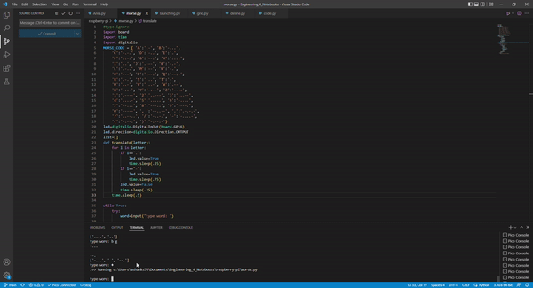
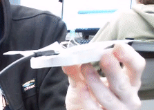
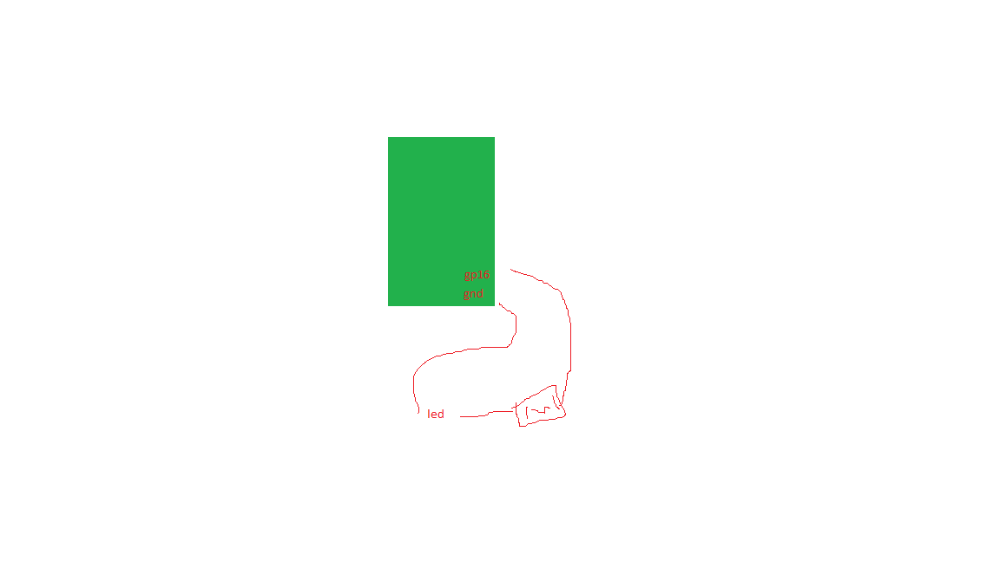
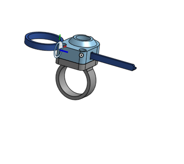
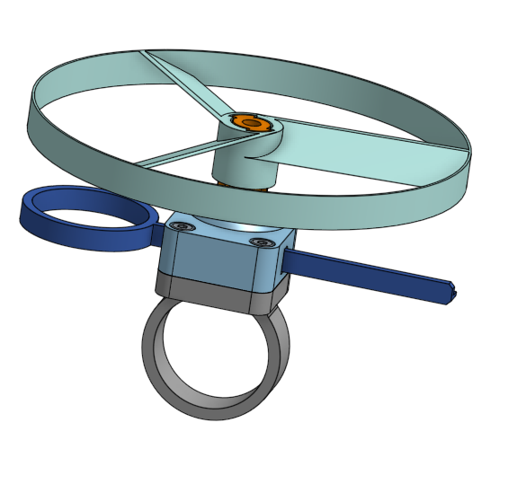
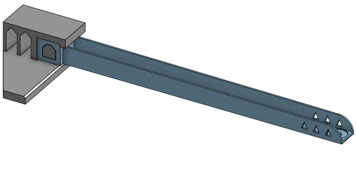
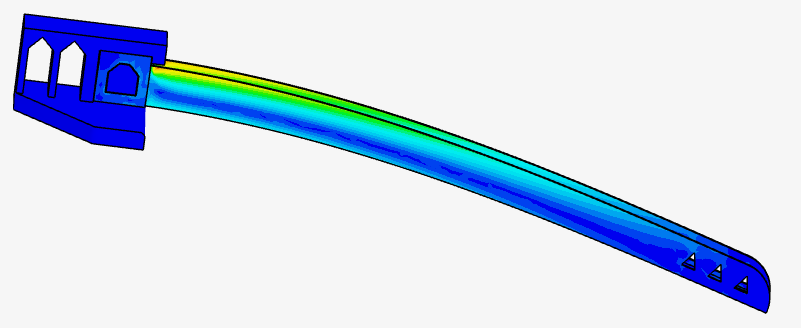

# Engineering_4_Notebook

&nbsp;

## Table of Contents
* [Raspberry_Pi_Assignment_Template](#Raspberry_Pi_Assignment_Template)
* [Onshape_Assignment_Template](#Onshape_Assignment_Template)
* 

&nbsp;

## Raspberry_Pi_Assignment_Template

### Assignment Description

### Evidence 

### Wiring

### Code
[Something like this](https://github.com/millerm22/Engineering_4_Notebook/blob/main/Raspberry_Pi/hello_world.py)

### Reflection

&nbsp;

&nbsp;

## Launchpad1

### Assignment Description

this required us to make the computer count down from 10 to 0.

### Evidence 

### Wiring

Not particularly necessary

### Code
[Launchpad!](https://github.com/Ashanks70/Engineering_4_Notebooks/blob/main/raspberry-pi/launchpad.py)

### Reflection

This assignment was fairly easy, just requr=iring me to remember some of the basics

&nbsp;

&nbsp;

## Launchpad2

### Assignment Description

This assignment required us to add a few blinking LEDs to the project to sync with time.

### Evidence 

### Wiring

### Code
[Launchpad!](https://github.com/Ashanks70/Engineering_4_Notebooks/blob/main/raspberry-pi/launchpad.py)

### Reflection

this one just required me to remember the syntax for LEDs and toss it into the previous work seamlessly.
&nbsp;

&nbsp;

## Launchpad3

### Assignment Description

this assignment required a button to be integrated and an "abort" function to work with it.

### Evidence 

### Wiring

### Code
[Launchpad!](https://github.com/Ashanks70/Engineering_4_Notebooks/blob/main/raspberry-pi/launchpad.py)

### Reflection

During this assignment I rewrte my entire code to make it cleaner and simpler to read.

&nbsp;

&nbsp;

## Launchpad4

### Assignment Description

this assignment required us to actuate a servo at the end, or make it move progressively earlier

### Evidence 

### Wiring

### Code

[Launchpad!](https://github.com/Ashanks70/Engineering_4_Notebooks/blob/main/raspberry-pi/launchpad.py)

### Reflection

the math for this was kind of a pain, but I was happy that I remembered how to do some of the fancy division logic. I read part of the assignment wrong and so the servo is moving for the wrong amount of time,  but was accepted anyway.

&nbsp;
&nbsp;

## Accelerometer

### Assignment Description
we had to print the values of the accelerometer to the serial monitor.

### Evidence 

### Wiring

### Code
[Accelerometer](https://github.com/Ashanks70/Engineering_4_Notebooks/blob/main/raspberry-pi/Accelerometer.py)

### Reflection
this assignment was simple, but the text blob took a little time.

&nbsp;
&nbsp;

## Powerboost

### Assignment Description
We had to light up an LED if it turned 90 degrees and had to make it battery powered

### Evidence 

### Wiring

### Code
[Accelerometer](https://github.com/Ashanks70/Engineering_4_Notebooks/blob/main/raspberry-pi/Accelerometer.py)

### Reflection
this one just took a little legwork to find out how gravity functioned in relation to slightly off numbers

&nbsp;
&nbsp;

## OLED screen

### Assignment Description
we had to make an OLED screen output the numbers instead of the serial monitor

### Evidence 

### Wiring

### Code
[Accelerometer](https://github.com/Ashanks70/Engineering_4_Notebooks/blob/main/raspberry-pi/Accelerometer.py)

### Reflection
This assignment, I had to get some extra help because it was printing new values over my screen. I fixed it with moving all that to my while true.

&nbsp;
&nbsp;

## Barometer

### Assignment Description
I had to add a barometer that disabled it if it was 3 meters above the starting point

### Evidence 

### Wiring

### Code
[Accelerometer](https://github.com/Ashanks70/Engineering_4_Notebooks/blob/main/raspberry-pi/Accelerometer.py)

### Reflection
This one was hard. I had to find [an Adafruit tutorial](https://learn.adafruit.com/using-mpl3115a2-with-circuitpython/overview) to complete it. I was starting to struggle to fit the pins, and due to code difficulties, just decided to add an extra sda/scl connection

&nbsp;
&nbsp;

## Landing Area 1

### Assignment Description
for this assignment, we had to take three points and find the area of the formed triangle.

### Evidence 

### Wiring
no wires are needed for this assignment

### Code
[Area](https://github.com/Ashanks70/Engineering_4_Notebooks/blob/main/raspberry-pi/Area.py)

### Reflection
This assignment was painful. Because I had never used a try/except, almost forgot how lists work, and completely forgot heron's formula, this assignment took a while. First, I found Heron's formula and wrote it down. I also made a function with a try/except and took a minute to test for an int. The list part was simple, and I just had to remember listname[0] and listname[1].

&nbsp;
&nbsp;

## Landing Area 2

### Assignment Description
for this assignment,we had to take all of the information and put it down on an OLED screen.

### Evidence 

### Wiring

### Code
[Area](https://github.com/Ashanks70/Engineering_4_Notebooks/blob/main/raspberry-pi/Area.py)

### Reflection
this part was difficult, but I had already done all of the hard things in the previous part, so I just had to establish the integers of my variables and relate the points around the origin.

&nbsp;
&nbsp;

##Landing Area 3

### Assignment Description
For this assignment, I had to determine the closest triagnle with an area greater than 100

### Evidence 

### Wiring

### Code
[Something like this](https://github.com/millerm22/Engineering_4_Notebook/blob/main/Raspberry_Pi/hello_world.py)

### Reflection
this assignment was a slog, but it got finished fairly quickly.

&nbsp;
&nbsp;

## Morse code 1

### Assignment Description
we had to translate words into chunks of morse code

### Evidence 

### Wiring
you don't need any wires for this

### Code
[Morse Code](https://github.com/Ashanks70/Engineering_4_Notebooks/blob/main/raspberry-pi/morse.py)

### Reflection
At first, I read the assignment wrong and thought it also wanted an LED, so I coded that second assignment(and finished it) before really focusing on this one.

&nbsp;
&nbsp;

## Morse Code 2

### Assignment Description
this assignment required us to blink a LED with the morse code.

### Evidence 

### Wiring

### Code
[Morse Code](https://github.com/Ashanks70/Engineering_4_Notebooks/blob/main/raspberry-pi/morse.py)

### Reflection
This assignment was kind of annoying to start, but since I mostly understood how dictionaries work in python, it was a matter of looking for the numerous different mistakes I made

&nbsp;

## Onshape_Assignment_Template

### Assignment Description

### Part Link 

### Part Image

### Reflection

&nbsp;

&nbsp;

## Ring

### Assignment Description

I had to follow the instructions to build a ring in onshape

### Part Link 

[teamwork!](https://cvilleschools.onshape.com/documents/3aa312c08f145112890ad27c/w/8b2620cc6fde6f2649d3b2f0/e/71025ffb9d5d2152cb2a5e13?renderMode=0&uiState=636d119a52f170477f97f721)

### Part Image

### Reflection
This was really simple to make and it just required me to follow the instructions. The other part on this side was far more complicated and required the helix tool to complete. I think that this assignment was fairly unbalanced in design.

&nbsp;
&nbsp;

## Key

### Assignment Description
I had to make a jagged rack that was attached to a pull-circle

### Part Link 

[teamwork!](https://cvilleschools.onshape.com/documents/3aa312c08f145112890ad27c/w/8b2620cc6fde6f2649d3b2f0/e/71025ffb9d5d2152cb2a5e13?renderMode=0&uiState=636d119a52f170477f97f721)

### Part Image

### Reflection
This part was also very simple and required me to follow the directions. After using a rack and pinion relation in my project last year, this felt simple, and I use linear patterns regularly for my parts.

&nbsp;
&nbsp;

## Ring & Key Assembly

### Assignment Description
We had to assemble the parts made in  the previous assignments

### Part Link 

[teamwork!](https://cvilleschools.onshape.com/documents/3aa312c08f145112890ad27c/w/8b2620cc6fde6f2649d3b2f0/e/71025ffb9d5d2152cb2a5e13?renderMode=0&uiState=636d119a52f170477f97f721)

### Part Image

### Reflection
This also came with a sheet of instructions to follow, making it rather boring. I did it together with my partner and we got it done with quickly. the hardest part was animating it afterwards.

&nbsp;
&nbsp;

## FEA 1

### Assignment Description
We had to design a beam that would hold as much as we could make it with a length of 200 mm and 13 grams of material

### Part Link 

[beam](https://cvilleschools.onshape.com/documents/34f9b9f6b9a6d5d97f68f198/w/f04197a87a1dec7558ea7a46/e/e540280db2672cb2008c8b17?renderMode=0&uiState=636d115f3b23f06f59035025)

### Part Image

### Reflection
This took a lot of research, but we got a fairly simple, but functional design. We tried to make an H-beam first, before realizing that there was too much overhang, which also ruled out I-beams. We settled on a simple design of a plank with support beams.

&nbsp;
&nbsp;

## FEA 2

### Assignment Description
We had to input the beam into simscale in order to measure the deflection and von misses stress with a weight of 30 N

### Part Link 

[beam](https://cvilleschools.onshape.com/documents/34f9b9f6b9a6d5d97f68f198/w/f04197a87a1dec7558ea7a46/e/e540280db2672cb2008c8b17?renderMode=0&uiState=636d115f3b23f06f59035025)

### Part Image

### Reflection
We ended up with a deflection of 46 mm for the first run. We will work on improving it later. We see a lot of failure closer to the box, and it is likely to snap sooner. We broke around 3 kilograms for our test. We also realized we were likely to break at the top, or bend too much towards the bottom. We decided that we had to increase the mass at the left to reduce deflection. we need to increase the thickness later.

&nbsp;

&nbsp;

## FEA 3

### Assignment Description
We had to work on improving our previous design for the beam.

### Part Link 

[beam](https://cvilleschools.onshape.com/documents/34f9b9f6b9a6d5d97f68f198/w/f04197a87a1dec7558ea7a46/e/e540280db2672cb2008c8b17?renderMode=0&uiState=636d115f3b23f06f59035025)

### Part Image

### Reflection
We ended up making it taller, but thinner, and ended up with a deflection of 37 mm afterwards. Making it more compact decreased the stress and therfore displacement to reduce our deflection as a whole. This made us win the first class competition, but we need to improve it so we don't end up losing in the second contest.

&nbsp;

## Media Test

Your readme will have various images and gifs on it. Upload a test image and test gif to make sure you've got the process figured out. Pick whatever image and gif you want!

### Link
[Shh!](https://github.com/Ashanks70/Engineering_4_Notebooks/#Link)
### Test Image

### Test GIF

